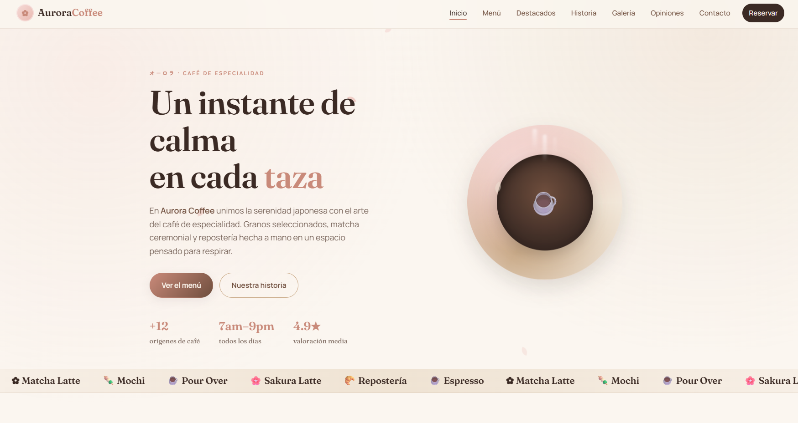
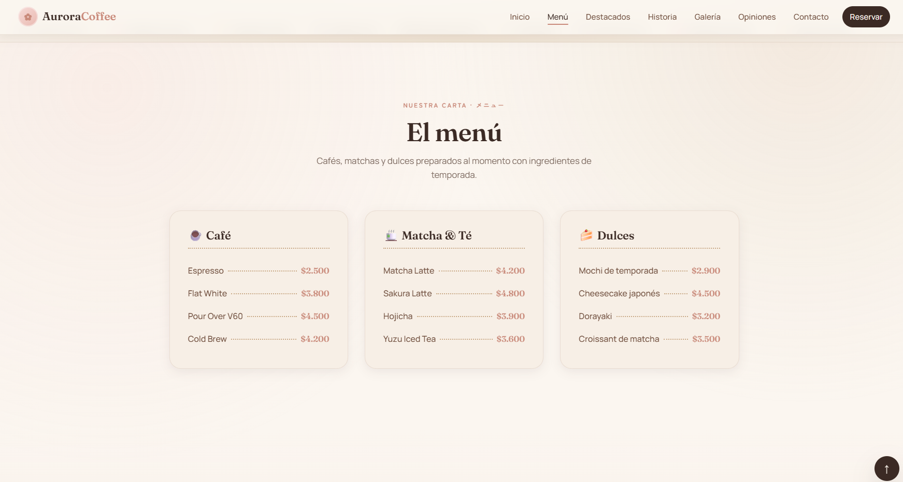
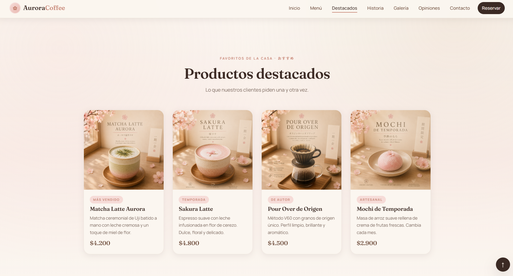
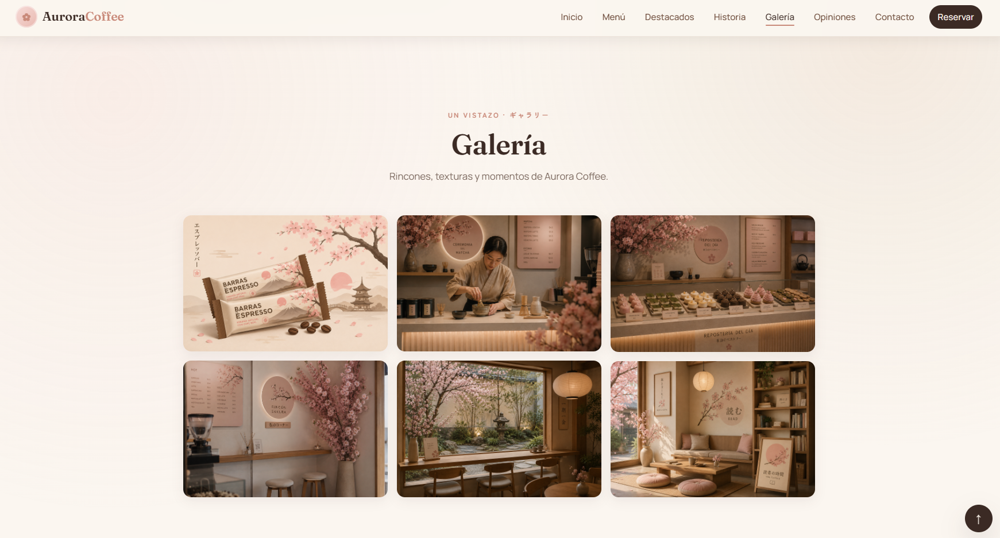
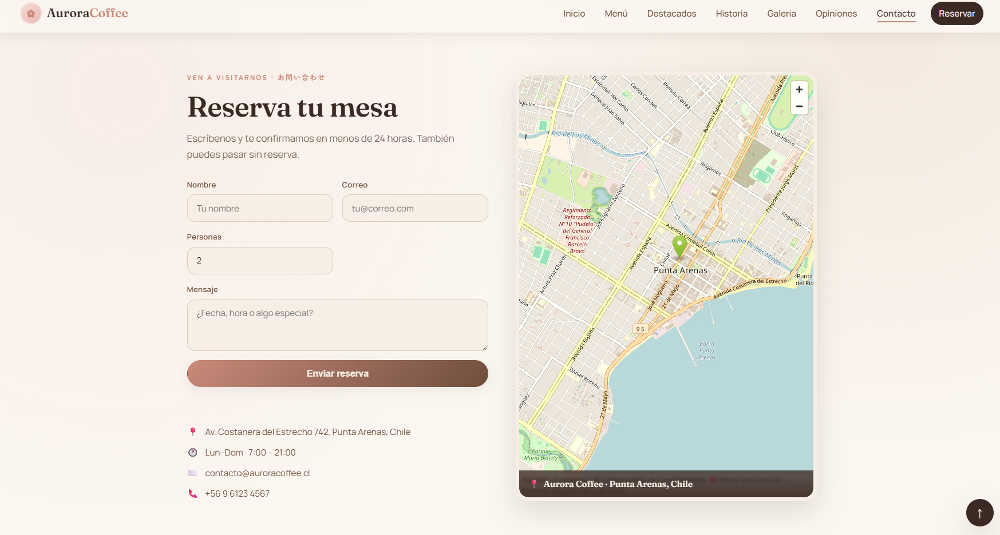

# ☕ Aurora Coffee


Sitio web corporativo para una cafetería ficticia de inspiración japonesa, diseñado con una estética moderna, cálida y totalmente responsive.

---

## 📖 Descripción

**Aurora Coffee** es una landing page creada para representar la presencia digital de una cafetería artesanal ubicada ficticiamente en Punta Arenas, Chile.

El proyecto forma parte de mi portafolio profesional y demuestra habilidades en desarrollo frontend, diseño responsive, accesibilidad, animaciones y experiencia de usuario.

---

## 🎯 Objetivo

Crear una landing page moderna que permita:

- Presentar la identidad y propuesta de valor de la marca.
- Mostrar el menú y sus productos destacados.
- Dar a conocer la historia de la cafetería.
- Exhibir fotografías y opiniones de clientes.
- Facilitar reservas y consultas.
- Informar la ubicación y los datos de contacto.

---

## ✨ Funcionalidades

- Diseño responsive para dispositivos móviles, tablets y escritorio.
- Navegación fluida entre secciones.
- Menú móvil accesible.
- Hero interactivo con animaciones.
- Menú con precios expresados en pesos chilenos.
- Sección de productos destacados.
- Historia e identidad de la cafetería.
- Galería adaptable con visor de imágenes a pantalla completa.
- Opiniones de clientes.
- Formulario de contacto con validación.
- Mapa de ubicación en Punta Arenas.
- Animaciones de aparición mediante `IntersectionObserver`.
- Navegación activa según la sección visible.
- Botón para volver al inicio.
- Compatibilidad con `prefers-reduced-motion`.

---

## 🛠 Tecnologías

- HTML5 semántico.
- CSS3 moderno.
- JavaScript Vanilla.
- CSS Grid y Flexbox.
- Google Fonts: Fraunces, Zen Maru Gothic y Manrope.
- OpenStreetMap.

El proyecto no utiliza frameworks ni dependencias externas de JavaScript.

---

## 📂 Estructura del proyecto

```text
AuroraCoffee/
├── assets/
│   ├── banner.png
│   ├── barrasdeespresso.png
│   ├── capptura-inicio.png
│   ├── captura-contacto.png
│   ├── captura-destacados.png
│   ├── captura-galeria.png
│   ├── captura-menu.png
│   ├── ceremoniadelmatcha.png
│   ├── especiales.png
│   ├── matchalatteaurora.png
│   ├── mochidetemporada.png
│   ├── pouroverdeoriggen.png
│   ├── reposteriadeldia.png
│   ├── rinconsakura.png
│   ├── sakuralatte.png
│   ├── ventanalconjardin.png
│   └── zonadelectura.png
├── index.html
├── styles.css
├── script.js
├── LICENSE
└── README.md
```

---

## 📸 Capturas de pantalla

### Inicio



### Menú



### Productos destacados



### Galería



### Contacto



---

## 🚀 Demo

- [Ver sitio web](https://aurora-coffee-bay.vercel.app/)
- [Ver repositorio](https://github.com/Nubby01/aurora-coffee)

---

## ⚙ Instalación

Clona el repositorio:

```bash
git clone https://github.com/Nubby01/aurora-coffee.git
```

Ingresa al proyecto:

```bash
cd aurora-coffee
```

Abre `index.html` directamente en el navegador o inicia un servidor local:

```bash
python -m http.server 8000
```

Luego visita `http://localhost:8000`.

---

## 📅 Roadmap

- [x] Landing page principal.
- [x] Diseño responsive.
- [x] Animaciones e interacciones.
- [x] Galería con lightbox.
- [x] Formulario de contacto.
- [x] Mapa de ubicación.
- [ ] Modo oscuro.
- [ ] Internacionalización.
- [ ] Sistema de reservas conectado a un backend.

---

## 🧪 Futuras mejoras

- Implementar un backend para procesar reservas.
- Crear un catálogo dinámico de productos.
- Incorporar un blog sobre café y cultura japonesa.
- Añadir un panel administrativo.
- Optimizar las imágenes a formatos WebP o AVIF.
- Incorporar pruebas automatizadas y analítica web.

---

## 👩‍💻 Autora

**Anthara Sáez**

Estudiante de Ingeniería en Informática y fundadora de **SaezTecnology**.

- [GitHub](https://github.com/Nubby01)
- [LinkedIn](https://www.linkedin.com/in/anthara-delgado-s%C3%A1ez-b9350a423/)

---

## 📄 Licencia

Este proyecto se distribuye bajo la [licencia MIT](LICENSE). Puedes utilizarlo, modificarlo y compartirlo respetando sus términos.
